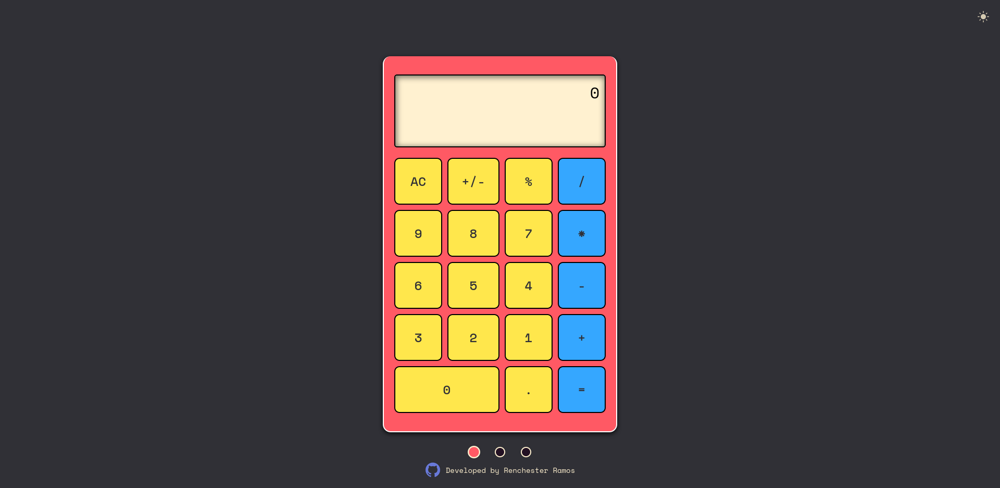
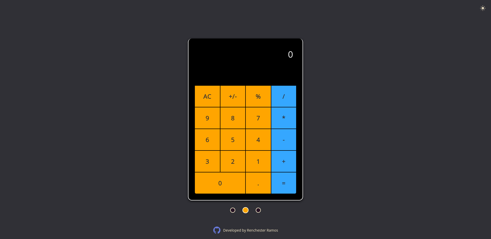
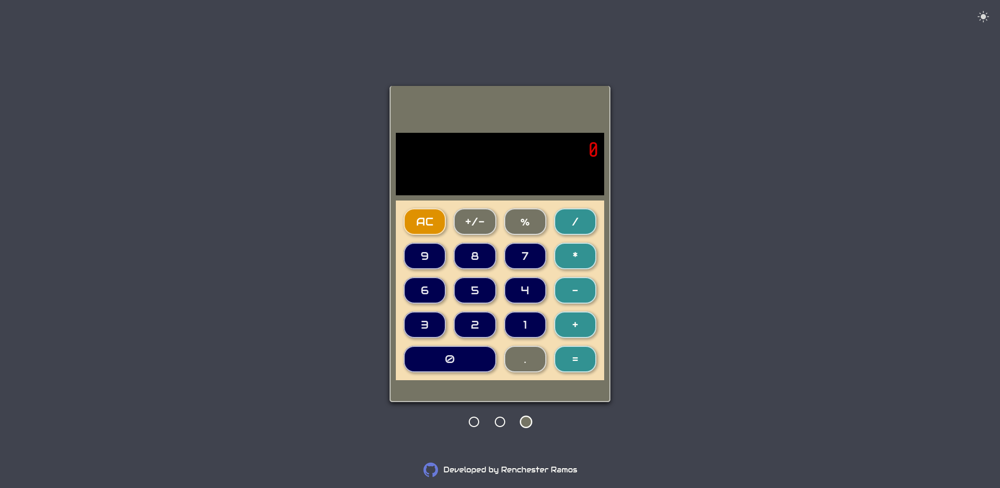

# The Odin Project

## Project: Calculator

**Live version** of the project is [here](https://renchester.github.io/top-calculator/)

_Calculator Design_

A simple calculator project to fully exercise what's been learned throughout the Front-end Basics in the Foundations course of the Odin Project.

### Logic

For this calculator project, the first number input is stored in a variable which will then be used later on when the user selects an operation and second number. An evaluate function is used to get the value of the stored first number, stored operation, and the second number input. From there, the answer is stored as the first number from which another expression may be evaluated. The calculator also prevents users from dividing with zero, which will result in an error.

### Design & UX

The design implements the typical calculator layout with different colors for the helpers, numbers, and the operators. The display at the top shows the user input as well as the answers to the calculations. The program also has a selector at the bottom which changes the design of the calculator to either a sleek design or a retro one--without disturbing the calculations.

_Sleek calculator design_

_Retro calculator design_

_Developed by Renchester Ramos_
